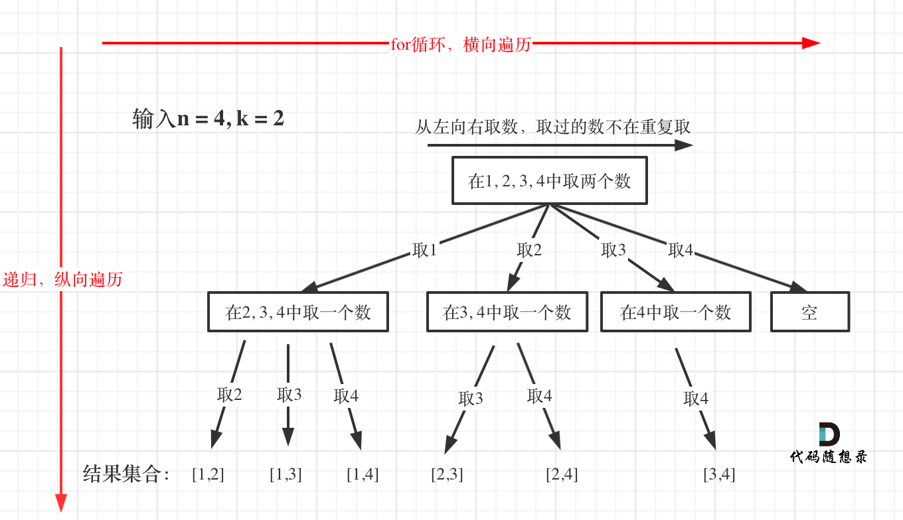
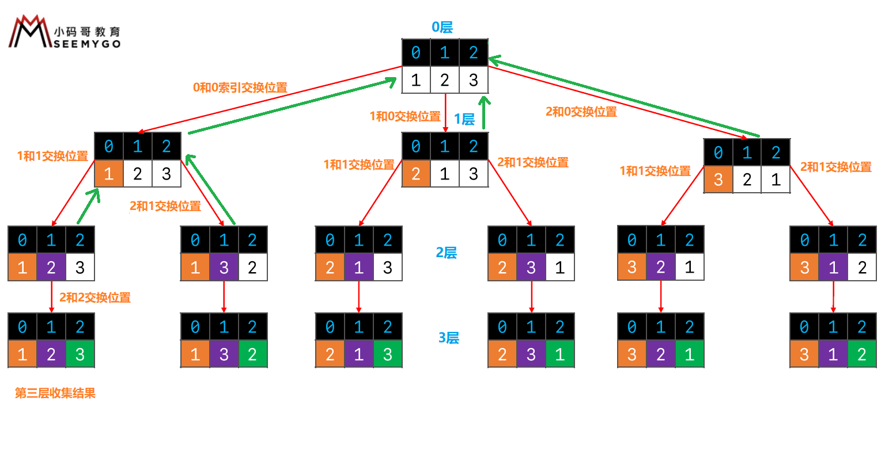

### 什么是回溯

回溯就是递归，二叉树的后序遍历就是典型的回溯。即做完后续的事情之后，能够回到当前的状态

回溯并不高效，本质就是穷举法，通过剪枝可以提升效率

剪枝：提前对不可能满足的情况做出排除法。比如我还需要选5个元素,但是可选元素只剩下3个了,那后续的递归就没必要进行了

---

如何理解回溯？

```text
假如给你{a,b,c,d},让你选择其中的任意3个作为一组,返回所有的可能(排列)

层数
 0          a                b                c                d             →树的宽度
 1     b    c    d      a    c    d      a    b    d      a    b    c
 2    c d  b d  b c    c d  a d  a c    b d  a d  a b    b c  a c  a b       ↓ 树的深度
 3    ^ ^  ^ ^  ^ ^    ^ ^  ^ ^  ^ ^    ^ ^  ^ ^  ^ ^    ^ ^  ^ ^  ^ ^
```

注意：只有第三层用来收集结果,前面的层都是用来选择元素

---

回溯算法的通用模板：

```text
public class Demo{
    void backtracking(当前层数，其它参数) {    // 参数必含当前层数
        if (终止条件) {    // 当前层数等于最大层数
            存放结果;
            return;
        }
        for (选择：本层集合中元素（树中节点孩子的数量就是集合的大小）) {
            处理节点;   // 比如 add(curElement)
            backtracking(当前层数+1，路径，选择列表); // 递归进入下一层
            回溯，撤销处理结果  // 比如 remove(curElement)
        }
    }
}
```

---



回溯解决组合问题：

如何防止重复的选择(去重)？
> 答：就第一个元素的索引开始往后遍历,直接忽略掉前面的元素

例如对于字符串abcdef：
> 组合问题：选取一个a之后，在bcdef中再去选取第二个，选取b之后在cdef中在选组第三个.....。

比如：

```text
层数                                     可选元素小于3,从这里开始可以剪枝
 0          a                b                c                d             →树的宽度
 1     b    c    d         c    d             d                ^
 2    c d   d    ^         d    ^             ^                ^             ↓ 树的深度
 3    ^ ^   ^    ^         ^    ^             ^                ^

我第0层选了a，遍历完这次；下次我第0层选了b，那么我之后只能选c、d。因为含有a的所有情况我已经选择了
```

---


回溯解决子集问题：

**在树形结构中子集问题是要收集所有节点的结果，而组合问题是收集叶子节点的结果**

---



回溯解决排列问题：

如何防止重复的选择(去重)？

> 每进入一层,让for中的[startIndex,num.length - 1],分别跟startIndex元素交换位置,递归完后交换回来


